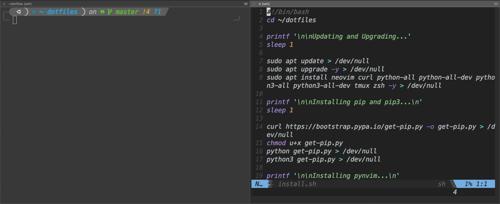

# pdotfiles
These are my custom dotfiles that I use on the daily

Note: I personally use iTerm as my terminal so it looks beautiful in that, if using other terminals, powerlevel10k may not be able to render the fonts correctly depending what you are using. Make sure that Powerline fonts are installed on the system too.



## Installation
```
git clone https://github.com/ZoneMix/pdotfiles.git ~/dotfiles --recursive --recurse-submodules; cd ~/dotfiles; chmod u+x install.sh; ./install.sh
```
